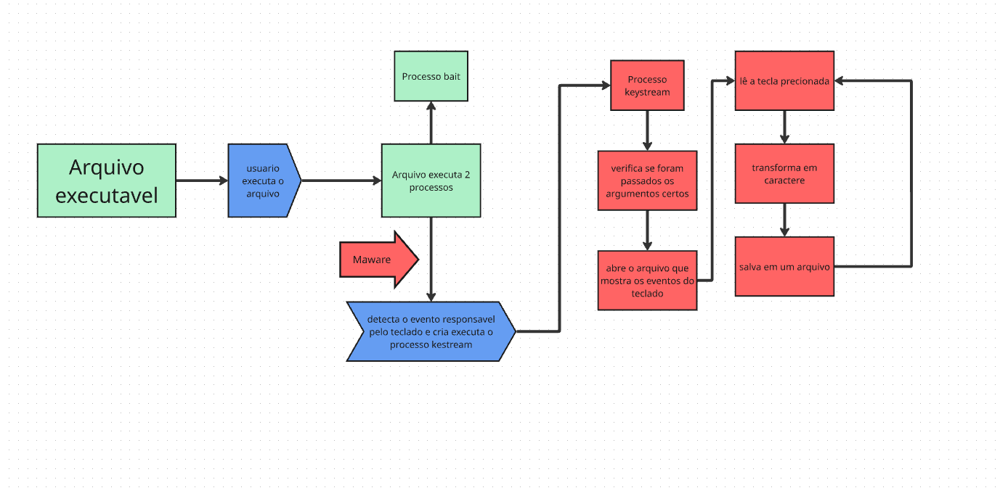

# MALWARE DIDÁTICO e sistema de arquivos XFS

## Sistema de arquivos
Para separarmos os tópicos da apresentação, decidimos explicar sobre o sistema de arquivos xfs em outro documento, acesse:

* [XFS](SA/docs/README.md)
  
---

## Índice

## Índice

- [MALWARE DIDÁTICO e sistema de arquivos XFS](#malware-didático-e-sistema-de-arquivos-xfs)
  - [Sistema de arquivos](#sistema-de-arquivos)
  - [Índice](#índice)
  - [Índice](#índice-1)
  - [Descrição do projeto](#descrição-do-projeto)
  - [EQUIPE OS Sem hexa](#equipe-os-sem-hexa)
  - [Introdução e objetivos](#introdução-e-objetivos)
  - [Diagrama de blocos](#diagrama-de-blocos)
  - [Explicações do código](#explicações-do-código)
  - [Como utilizar o projeto](#como-utilizar-o-projeto)
  - [Testes](#testes)
    - [keylogger (main.c)](#keylogger-mainc)
  - [Uso de IA](#uso-de-ia)
  - [Bibliografia](#bibliografia)
  
--- 

## Descrição do projeto

Projeto desenvolvido para a diciplina de Sistemas Operacionais. O projeto visa a construção de um malware didático que irá ser instalado através de um arquivo executável na máquina do hospedeiro e ficará em segundo plano lendo o teclado e salvando em um arquivo.

---

## EQUIPE OS Sem hexa

integrantes:

* FILIPE ALCÂNTARA DA COSTA - 568346
* GUSTAVO OLIVEIRA SEABRA - 567464
* SAVLIO CARVALHO PONTES - 567715

---

## Introdução e objetivos

Nosso objetivo com esse projeto é criar um entendimento sobre estruturas a baixo nível do computador. Queremos entender como ocorre a comunicação de disposivos com o Sistema operacional. Além de entender o funcionamento de chamadas de sistema, eventos, processos em segundo plano, entre outros.

Para tanto, nossa ideia foi criar um arquivo executável que irá usar essas chamadas de sistema para criar um processo em segundo plano, o qual será o nosso vírus. Esse por sua vez ficará lendo eventos do computador, usando syscalls para salvar em um arquivo secundário.

Como ferramenta, usamos principalmente o sistema operacional linux, seja em maquina virtual, ou propiamente dito. A linguagem C bem como alguns arquivos para o shell foram usados. O miro foi usado para os diagramas de blocos.

---

## Diagrama de blocos

---

## Explicações do código

Para melhor visibilidade, as documentações que explicam sobre os códigos especificos de cada arquivo estarão listadas a seguir:

* Arquivo responsável por ser executado pelo usuario e inicializar o arquivo bait e o keylogger: [binder](projeto/docs/binder.md)
* Arquivo responsável por ler as teclas: [keylogger](projeto/docs/keylogger.md)

---

## Como utilizar o projeto

Basicamente, o "Hacker" deve gerar o arquivo que contém o Logger.Para isso ele deve fazer:

1. No diretório projeto/ executar "make build" para compilar o logger - out.out
2. No diretório projeto/dist/ executar "make" para compilar o arquivo que contem o logger e um arquivo bait
3. Compartilhar o arquivo compilado com o vírus ofuscado

---

## Testes

### keylogger (main.c)

Para testarmos o monitorador do teclado, foram seguidos os seguintes passos:

1. Fazer um script que lê um arquivo em /dev/input/eventX e o decodifica usando a `struct input_events` do Linux
2. Printar o resultado da leitura no terminal
3. Fazer uma análise da saída
4. Identificar qual tecla mapeia para qual valor da tabela definida em `input-event-codes.h`

Dessa maneira foi possível construir o mapeamento de caracteres no código para um layout físico, simulando o que é implementado em bibliotecas oficiais, como na biblioteca `libxkbcommon`.

---

## Uso de IA

Para a claresa academica, detalharemos onde nos usamos Inteligencia artivicial durante o projeto

* A documentação foi feita por nós, mas utilizamos IA para o entendimento de algumas funcionalidades do Markdown e para a clareza de alguns termos e conceitos duvidosos do xsf. E o índice.
* No binder e no keyloger, usamos IA para pesquisa mais rápida sobre algumas partes mais a baixo nivel do linux, bem como para algumas consutas de revisão. Como apoio.

## Bibliografia

alguns links para estudo:

* [instalando uma vm](https://github.com/JunioCesarFerreira/Cooja-Docker-VM-Setup/blob/main/vm%2Fprepare-vm-enviroment.md)
* [sobre scripts C](https://share.google/EqrbeKSctUIsfWHEi)
* [Coding a Keylogger in raw C](https://youtu.be/sw26Ptkdhuc)
* [XSF - arquilinux](https://man.archlinux.org/man/xfs.5.en)
* [XSF - usado como base](https://www.ufsexplorer.com/articles/storage-technologies/xfs-file-system/)
* [sistema de arquivos no geral](https://www.youtube.com/playlist?list=PL866_LrQxNVhjUCo5b9iQLvgTtC9RoyO1)