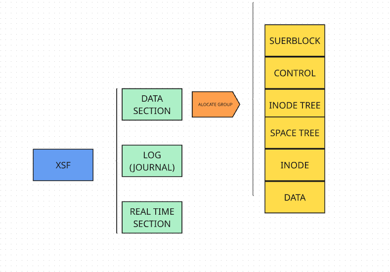

# XFS

## Introdução

XFS é um sistema de arquivos altamente escalável e de alta performance criado pela Silicon Graphics, Inc (SGI). Apesar de ter sido inicialmente um FS proprietário, hoje o XFS é um projeto de código aberto mantido pela comunidade Linux e utilizado por padrão por algumas distribuições, como o Red Hat Enterprise Linux (RHEL).

Por conta de suas altas capacidades de gerenciar arquivos massivos, XFS é amplamente utilizado em servidores e em matrizes de armazenamento. O projeto continua em desenvolvimento ativamente, recebendo melhorias e atualizações de tempos em tempos.

Uma de suas principais *features*, além de sua grande capacidade de escalabilidade, é a sua capacidade de guardar registros de suas operações. Isso permite recuperar rapidamente a consistência do sistema após falhas, como desligamento inesperado ou quedas de energia.

---

## Estrutura 
 
Para podermos analisar a estrutura do sistema de arquivos xfs, vamos subdividilo em algumas partes, sendo as seções: Real-time section, Log e Data section:


 
### 1 - Real time section

A seção de tempo real, é, como o nome já diz, voltada a sistemas de tempo real, cuja, velocidade em um tempo especifico e previsivel é desejada. Ela contem um sistema de alocação simples, consistindo em bit-map, o qual divide a seção em tamnho fixo para ser alocado.

### 2 - Log (Journal)

Essa seção tem como principio guardar os metadados de uma operação sempre que ela esta em atividade no xsf. Dessa forma, caso ocorra algumma queda de energia, ou outro acidente que promova uma falha na operação, o sistema pode recuperar os dados corrompidos atravez dessa seção, e continuar com a operação

### 3 - Data section

Essa é a principal seção do sistema de arquivos, é nela que vamos ter todos os arquivos e os gerenciamentos ou metodos para organiza-los.
A seção de dados é composta por varios Grupos de mesmo tamanho, chamados:

#### Alocation Groups(AG):

Cada AG contem o mesmo tamanho e serve como um minigerenciador de dados. Out seja, dentro do grupo, ele gerenciará os arquivos presentes nele. Ele será responsável por controlar, quais dos seus blocos estão ocupados, livres, quais *inodos* existem, e onde estão os metadados dos arquivos. Dentro de um AG, teremos algumas partes especificas, mas antes, alguns conceitos:

* **Bloco**: seria um espaço da memoria não divisivel no sistema de arquivo, com uma determinada quantidade de bytes, dessa forma a alocação refe-se a alocar tantos blocos para aquele arquivo

* **Extent**: O xsf armazena a alocação do arquivo na forma de uma extent, que é basicamente o conjunto entre o inicio do bloco de ocupação e a quantidade de blocos que ele ocupa, dessa forma, o sistema armazena de forma contigua o arquivo. A observação é que um arquivo pode ser dividido em varios extent, podendo ser separado em partes de diferentes tamanhos no disco.


* **Inode**: refere-se a uma estrutura de dados onde é armazenado informações de um determinado arquivo. Dessa forma ele contém: tamanho do arquivo, permissões, data da criação, enderesso onde esta no disco, etc. Só não contem o nome do arquivo. 


Um tipo de alocação de um INODE acontece, por exemplo, a alto nivel assim:

```txt
Arquivo 1:

%extent
ofsset 0
Bloco 5000
tamanho 800

%extent
ofsset 800
Bloco 9000
tamanho 500

```

* **B+ tree**: tipo arvores binarias, mas com um pai podendo ter mais de um filho.


Agora com os conceitos revisados, os AG são divididoes em:

##### A - Superblocos

Contem as informações referentes ao sistema de arquivos, tais como, os tamanhos dos sistema de aruivos, dos blocos, dos AGs e os limites e posições.

Observação é que todos os superblocos contem as mesmas informações, sendo o superbloco do AG0 o principal

##### B - Control

São estruturas para controle das Arvores B+ e dos superblocos

##### C - INODE Tree

Para o sistema ser mais rapido e ser mais facil de lidar com sistemas grandes, o xfs aloca tanto os inodes como os espaços em arvores B+, dessa forma, é mais rapido a consulta de onde esta o inode de determinado arquivo.

##### D - space tree

Novamente, tambem temos informações sobre os espaços em arvore B+. Mas agora temos duas com propositos diferentes, mas com as mesmas informações:

* A primeira é orientada pelo endereço, para caso eu queira alocar um arquivo em um endereço especifico.
* A Segunda é orientada pelo tamanho, caso eu queira alocar um arquivo de um tamanho especifico.

##### F - INODE + DATA

Por ultimo temos os que realmente guardam as informações do arquivo, pois as arvores são so os mecanismos para saberem onde eles estão na memoria. Os Inodes se referem as informações dos arquivos, e o Data são os blocos onde os arquivos estão

---


## Vantagens e desvantagens
